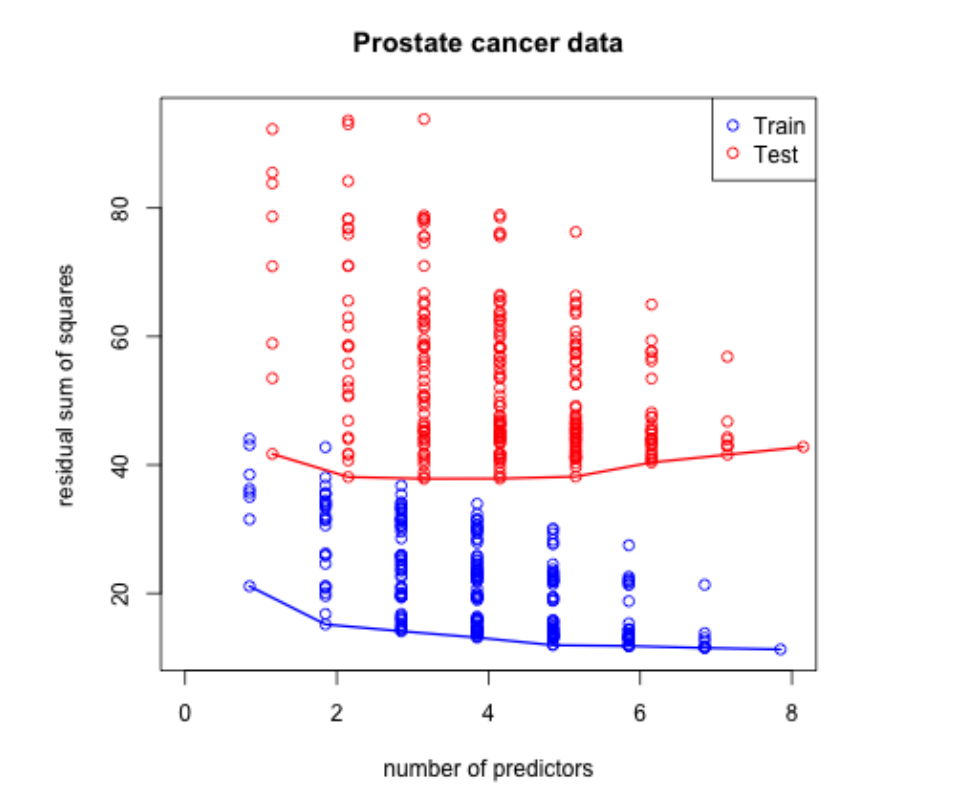
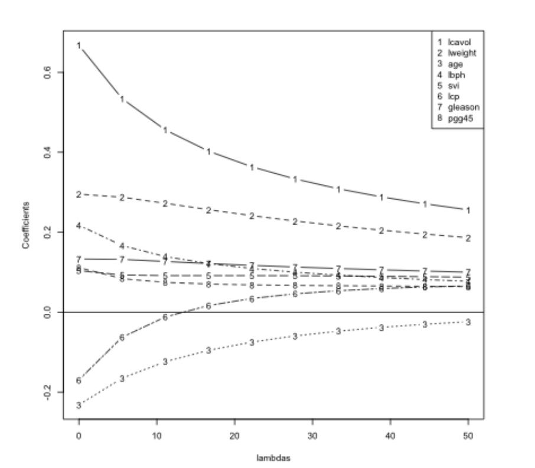

```{r setup, include=FALSE}
knitr::opts_chunk$set(echo = TRUE)
```

### Basic idea

1. Fit a regression model
2. Penalize (or shrink) large coefficients

__Pros:__

* Can help with the bias/variance tradeoff. Remember from our classes of multivariate regression :    
            a. **Omitting variables results in bias in the coefficients of interest - unless their regressors are uncorrelated with the omitted ones.**  
            b. **On the other hand, including any new variables increases (actual, not estimated) standard errors of other regressors. (So we don't want to idly throw variables into the model. )**

* Can help with model selection

__Cons:__

* May be computationally demanding on large data sets
* Does not perform as well as random forests and boosting

### A motivating example

* Consider a model 

$$Y = \beta_0 + \beta_1 X_1 + \beta_2 X_2 + \epsilon$$

where $X_1$ and $X_2$ are nearly perfectly correlated (co-linear). You can approximate this model by:

$$Y = \beta_0 + (\beta_1 + \beta_2)X_1 + \epsilon$$

The result is:

* You will get a good estimate of $Y$
* The estimate (of $Y$) will be biased 
* We may reduce variance in the estimate


#### Subset selection

* As the number of predictors increases the training error always decreases.

* However, for testing data it initially goes down but later plateaus and starts increasing. (Possibly due to overfitting the data)



#### Problem 1 [Common pattern seen]

* Observed prediction error for training data becomes smaller with model complexity regardless of the prediction ability on the test data


* Acces the code [here](http://www.biostat.jhsph.edu/~ririzarr/Teaching/649/)
* Detailed notes and maths can be found [here](http://www.biostat.jhsph.edu/~ririzarr/Teaching/649/section-07.pdf)

#### Solution

* When the amount of data and computation time permits it, there is no method
better than data splitting. The idea is simple: Divide the data in three parts: train, validation, and test. We use the train and validation data to select the best model
and the test data to assess the chosen model.

* The recipe is the following:  

      1. In the first part, model selection, the validation model is treated as the test data. We train all competing model on the train data and define the best model as the one that predicts best in the validation set. We could replit the train/validation data, do this many times, and select the method that, on average, best performs.
      
      2. Because we chose the best model among many competitors, the observed performance will be a bit biased. Therefore, to appropriately assess performance on independent data we look at the performance on the test set.
      
      3. Finally, we can resplit everything many times and obtain average results from step 1 & step 2.

__There is no obvious choice on how to split the data. A common choice is 1/2, 1/4, and 1/4__

* There are two common problems:

      1. When the amout of data is limited, the results from fitting a model to 1/2 the data can be substantially different to fitting to all the data. 
      2. Model fitting might have high computational requirements because we're trying all possible subsets of data.
      
#### Decomposing expected prediction error [EXTRA]

* We want to estimate f and assume our data comes from the following model: $Y_i = f(X_i) + \epsilon_i$

* Then our expected predicion error (EPE) is given by $EPE(\lambda) = E\left[\{Y - \hat{f}_{\lambda}(X)\}^2\right]$ (i.e, EPE is the expected squared diff. between the prediction $Y$ & the prediction $\hat{f}_{\lambda}(X)$)

* When we look at a new data point $X = x^*$

* The EPE can be decomposed into some error as following,

$$E\left[\{Y - \hat{f}_{\lambda}(x^*)\}^2\right] = \sigma^2 + \{E[\hat{f}_{\lambda}(x^*)] - f(x^*)\}^2 + var[\hat{f}_\lambda(x_0)]$$

<center> = Irreducible error + Bias$^2$ + Variance </center>

* Whenever we're building the prediction model, the goal is to reduce the above terms. Irreducible error can't be reduced (it's error due to sampling or other data generation errors), but we can trade-off __BIAS & VARIANCE__  


### Prostate cancer data

```{r prostate}
load("./Data/prostate.RData")
str(prostate)
```


#### Problem 2 is the issue of high-dimensionality data 

```{r cache=TRUE}
small = prostate[1:5,]
lm(lpsa ~ .,data =small)
```

* We can doing a linear regression with all variables for a small subset of data. We see that if the data entries are low, we get NA's for some predictors. 

__One Solution - Hard Thresholding__

* Hard thresholding and limiting the number of predictors

* Build a model $Y = f(X) + \epsilon$ by assuming it as a linear model $\hat{f}_{\lambda}(x) = x'\beta$

      * A linear model is an equation that describes a relationship between two quantities.

* Constrain only $\lambda$ coefficients to be nonzero. (Set a limit to number of coefficients/predictors by keeping all others `zero`)

* Selection problem is after chosing $\lambda$ we have to try and figue out which of the $p - \lambda$ combination of coefficients gives the best model, which is very _computationally demanding._

__Another solution is to use Regularised Regression__

### Regularization for regression

* If the $\beta_j$'s (preditors) are unconstrained:
      * They can explode
      * And hence are susceptible to very high variance (less accurate predictions)

* To control variance, we might regularize/shrink the coefficients. 

$$ PRSS(\beta) = \sum_{j=1}^n (Y_j - \sum_{i=1}^m \beta_{1i} X_{ij})^2 + P(\lambda; \beta)$$

where $PRSS$ is a penalized form of the sum of squares. (The first term is our RSE which we want to minimize. The second term is our penalty for large coefficients)

* Things that are commonly looked for
      
      * Penalty reduces complexity
      * Penalty reduces variance
      * Penalty respects structure of the problem

#### First approach to penalize (Ridge Regression)

* What's happening is now we work for minimizing:

$$ \sum_{i=1}^N \left(y_i - \beta_0 + \sum_{j=1}^p x_{ij}\beta_j \right)^2 + \lambda \sum_{j=1}^p \beta_j^2$$

equivalent to solving 
$\sum_{i=1}^N \left(y_i - \beta_0 + \sum_{j=1}^p x_{ij}\beta_j \right)^2$ subject to $\sum_{j=1}^p \beta_j^2 \leq s$ where $s$ is inversely proportional to $\lambda$ 

(normal error minimising with a constraint that causes the error to shoot up if the coefficients $\beta_j$ are high)


* Inclusion of $\lambda$ makes the problem non-singular even if $X^TX$ is not invertible. In other words, when we have more predictors than the observations then the ridge regression model can still be fit.

__Tuning parameter $\lambda$ __

* $\lambda$ controls the size of the coefficients.
* $\lambda$ controls the amount of regularization.
* As $\lambda \rightarrow 0$ we obtain the least square solution.
* As $\lambda \rightarrow \infty$ we have $\hat{\beta}_{\lambda=\infty}^{ridge} = 0$
      * __Thus picking the parameter $\lambda$ can be done with cross-validation or other techniques to pick the best one for your optimal Bias-Variance tradeoff.__
      
* You can see from the below plot that as we increase $\lambda$ the coeeficients tend to go to zero.



#### Second approach to penalize (Lasso)

* Little change in the penalty term. We take the absolute value here ($\sum_{j=1}^p |\beta_j| \leq s$ )

equivalent to solving 
$\sum_{i=1}^N \left(y_i - \beta_0 + \sum_{j=1}^p x_{ij}\beta_j \right)^2$ subject to $\sum_{j=1}^p |\beta_j| \leq s$ 

* Also has a lagrangian form 

$$ \sum_{i=1}^N \left(y_i - \beta_0 + \sum_{j=1}^p x_{ij}\beta_j \right)^2 + \lambda \sum_{j=1}^p |\beta_j|$$

* For orthonormal design matrices (not the norm!) this has a closed form solution

$$\hat{\beta}_j = sign(\hat{\beta}_j^0)(|\hat{\beta}_j^0 - \gamma)^{+}$$ 

*Take the abs value of $\beta_j$ & subtract off a $\gamma$ value & take only the positive part $^+$ i.e, if diff. is -ve then it makes it 0; towards the positive end.
 
* __Basically saying the lasso shrinks the coefficients & sets some of them to zero; in turn equivalent to model selection in advance__

## Notes and further reading


* [Hector Corrada Bravo's Practical Machine Learning lecture notes](http://www.cbcb.umd.edu/~hcorrada/PracticalML/)
* [Hector's penalized regression reading list](http://www.cbcb.umd.edu/~hcorrada/AMSC689.html#readings)
* [Elements of Statistical Learning](http://statweb.stanford.edu/~tibs/ElemStatLearn/)
* In `caret` the methods for above solutions are:
  * `ridge`
  * `lasso`
  * `relaxo`


